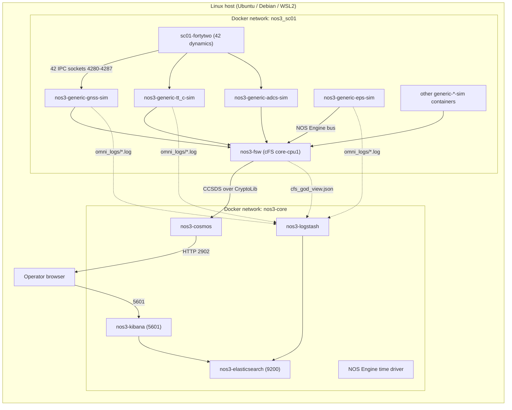
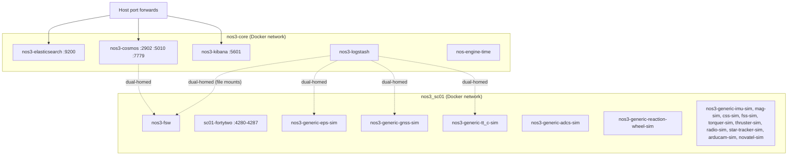
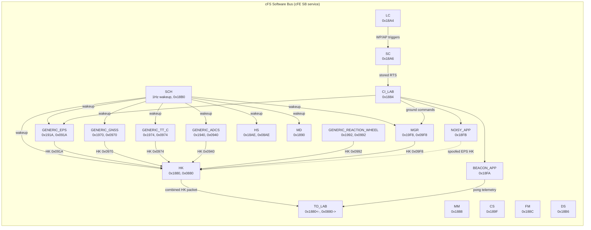
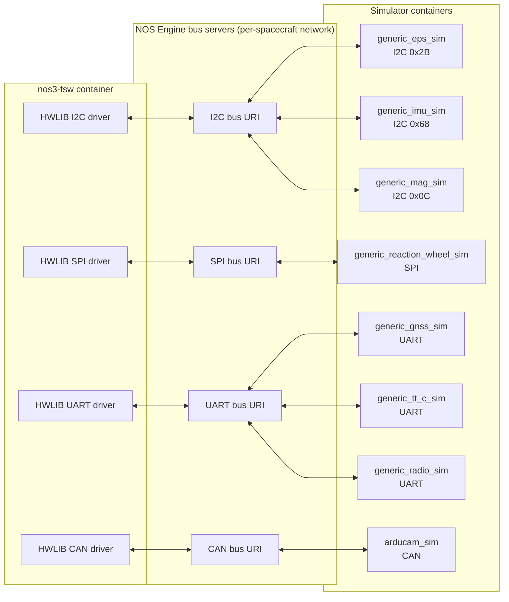
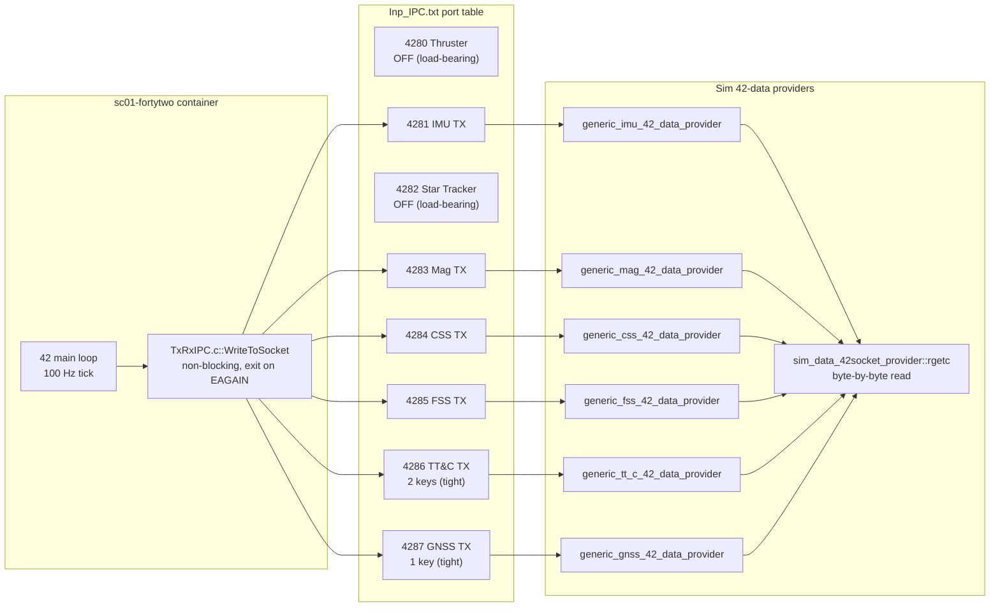
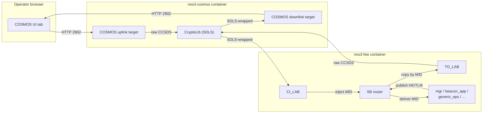
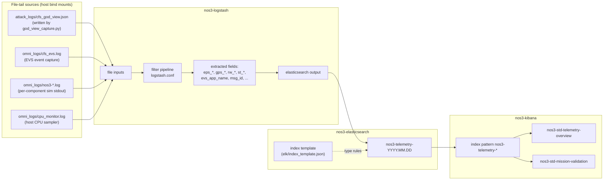
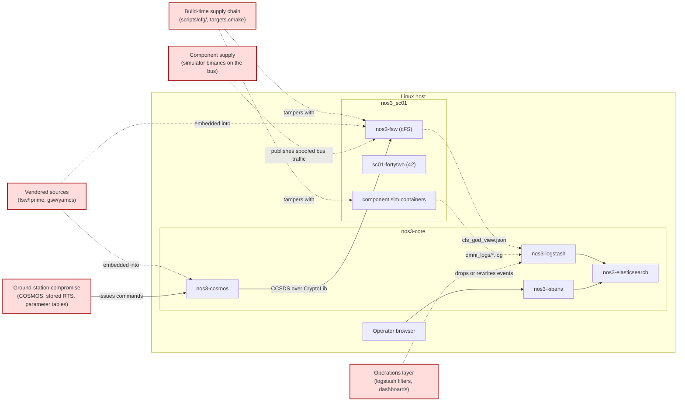

# 08. Figures (Mermaid + Plain-Text Captions)

This file is the single source of truth for every figure
referenced in the thesis document set. Each figure has two
representations:

- A fenced Mermaid block that renders directly in markdown
  viewers (GitHub, VSCode, MkDocs, most documentation
  pipelines).
- A plain-text node/edge caption that names every node, the
  edges between them, and any annotation. The plain-text
  form is the canonical specification: a draughtsman, an
  external rendering tool, or a TikZ/draw.io re-author can
  reproduce the figure from the caption alone.

Figures are numbered F1 through F8. Per-app focused
diagrams (the optional F9 series) live next to their app
documents under [`../04-apps/`](../04-apps/) and are not
duplicated here.

---

## F1 - System overview

### Mermaid

### Caption (for redrawing)

Nodes (group: outer host):
- HOST: "Linux host (Ubuntu / Debian / WSL2)"

Subgroup CORE inside HOST: "Docker network: nos3-core"
- N_ES: "nos3-elasticsearch", port 9200
- N_LS: "nos3-logstash"
- N_KB: "nos3-kibana", port 5601
- N_COSMOS: "nos3-cosmos"
- N_NOSENG: "NOS Engine time driver"

Subgroup SC inside HOST: "Docker network: nos3_sc01"
- N_FSW: "nos3-fsw (cFS core-cpu1)"
- N_FT: "sc01-fortytwo (42 dynamics)"
- N_SIMS_EPS: "nos3-generic-eps-sim"
- N_SIMS_GNSS: "nos3-generic-gnss-sim"
- N_SIMS_TTC: "nos3-generic-tt_c-sim"
- N_SIMS_ADCS: "nos3-generic-adcs-sim"
- N_SIMS_ETC: "other generic-*-sim containers"

Outside groups:
- N_BROWSER: "Operator browser"

Solid edges (data flow):
- N_FT -> N_SIMS_GNSS, label "42 IPC ports 4280-4287"
- N_FT -> N_SIMS_TTC, same label
- N_FT -> N_SIMS_ADCS, same label
- N_SIMS_EPS -> N_FSW, label "NOS Engine I2C/SPI/CAN"
- N_SIMS_GNSS -> N_FSW, same label
- N_SIMS_TTC -> N_FSW, same label
- N_SIMS_ADCS -> N_FSW, same label
- N_SIMS_ETC -> N_FSW, same label
- N_FSW -> N_COSMOS, label "CCSDS over CryptoLib (SDLS)"
- N_COSMOS -> N_BROWSER, label "HTTP 2902"
- N_BROWSER -> N_KB, label "5601"
- N_LS -> N_ES
- N_KB -> N_ES

Dashed edges (file-tail ingest):
- N_FSW -> N_LS, label "cfs_god_view.json"
- N_SIMS_EPS -> N_LS, label "omni_logs/*.log"
- N_SIMS_GNSS -> N_LS, same label
- N_SIMS_TTC -> N_LS, same label

Caption: figure F1, "System overview". Read top-to-bottom: 42
emits ground-truth state to the simulator containers; the
simulators emulate hardware buses to the flight software; the
flight software exchanges CCSDS frames with COSMOS through
CryptoLib; both the FSW Software-Bus log and the simulator
logs feed into the ELK telemetry pipeline.

---

## F2 - Container and network topology

### Mermaid

### Caption (for redrawing)

Two boxed regions, each labelled with a Docker network name:

- Box NOS3CORE, label "nos3-core (Docker network)":
  - "nos3-elasticsearch :9200"
  - "nos3-logstash"
  - "nos3-kibana :5601"
  - "nos3-cosmos :2902 :5010 :7779"
  - "nos-engine-time"

- Box NOS3SC01, label "nos3_sc01 (Docker network)":
  - "nos3-fsw"
  - "sc01-fortytwo :4280-4287"
  - "nos3-generic-eps-sim"
  - "nos3-generic-gnss-sim"
  - "nos3-generic-tt_c-sim"
  - "nos3-generic-adcs-sim"
  - "nos3-generic-reaction-wheel-sim"
  - "other generic-*-sim containers" (catch-all box for IMU,
    MAG, CSS, FSS, torquer, thruster, radio, star-tracker,
    arducam, novatel-oem615)

Outside both boxes, an HOST node labelled "Host port
forwards" with arrows to:
- "nos3-kibana :5601"
- "nos3-elasticsearch :9200"
- "nos3-cosmos :2902 :5010 :7779"

Dashed cross-network edges (containers attached to BOTH
networks):
- "nos3-cosmos" <-> "nos3-fsw"
- "nos3-logstash" <-> "nos3-fsw" (file bind mount)
- "nos3-logstash" <-> "nos3-generic-eps-sim" (file bind mount)
- "nos3-logstash" <-> "nos3-generic-gnss-sim" (file bind mount)
- "nos3-logstash" <-> "nos3-generic-tt_c-sim" (file bind mount)

Caption: figure F2, "Container and network topology". Two
networks: nos3-core (shared services) and nos3_sc01
(per-spacecraft). Containers that need traffic on both
planes are dual-homed; the dashed lines mark those.

---

## F3 - cFS Software Bus publish/subscribe

### Mermaid

### Caption (for redrawing)

A single boxed region labelled "cFS Software Bus (cFE SB
service)" containing app nodes. Each app node carries the
app name and its Message ID range:

- "SCH" (Scheduler): 1Hz wakeup, 0x18B0
- "HK" (Housekeeping aggregator): 0x1880 in, 0x0880 out
- "HS" (Health & Safety): 0x18AE / 0x08AE
- "TO_LAB" (Telemetry output): downlink path
- "CI_LAB" (Command input): uplink path, 0x1884
- "SC" (Stored command): 0x18A6
- "LC" (Limit checker): 0x18A4
- "MD" (Memory dwell): 0x1890
- "MM" (Memory manager): 0x1888
- "CS" (Checksum): 0x189F
- "FM" (File manager): 0x188C
- "DS" (Data storage): 0x18B6
- "GENERIC_EPS": 0x191A / 0x091A
- "GENERIC_GNSS": 0x1970 / 0x0970
- "GENERIC_TT_C": 0x1974 / 0x0974
- "GENERIC_ADCS": 0x1940 / 0x0940
- "GENERIC_REACTION_WHEEL": 0x1992 / 0x0992
- "MGR" (Mission manager, DTU): 0x19F8 / 0x09F8
- "BEACON_APP" (DTU): 0x18FA
- "NOISY_APP" (DTU, attack instrumentation): 0x18FB

Edges:
- SCH -> {EPS, GNSS, TTC, ADCS, MGR, HK, HS, MD}, label "wakeup"
- {EPS, GNSS, TTC, ADCS, RW, MGR} -> HK, label "HK <MID>"
- HK -> TO, label "combined HK packet"
- BCN -> TO, label "pong telemetry"
- NOISY -> HK, dashed, label "spoofed EPS HK" (this is the
  attack-injection edge; mark visually distinct)
- CI -> {MGR, EPS, BCN, NOISY}, label "ground commands"
- SC -> CI, label "stored RTS"
- LC -> SC, label "WP/AP triggers"

Visual treatment notes:
- Highlight DTU-altered nodes (MGR, BCN, NOISY, GENERIC_EPS,
  GENERIC_TT_C, GENERIC_GNSS, GENERIC_ADCS,
  GENERIC_REACTION_WHEEL) in a distinct colour.
- The NOISY -> HK edge is the attack-relevant publication;
  draw it dashed and red.

Caption: figure F3, "cFS Software Bus publish/subscribe".
Apps publish and subscribe to MIDs on the SB; SCH drives the
1 Hz wakeup, HK aggregates app HK packets into a combined
downlink, TO_LAB downlinks, CI_LAB uplinks. The NOISY_APP
spoofed EPS HK edge is the attack-injection point used in
the noisy_app deep-dive.

---

## F4 - FSW to simulator bus topology

### Mermaid

### Caption (for redrawing)

Three vertical lanes:

Lane 1 ("nos3-fsw container"):
- HWLIB I2C driver
- HWLIB SPI driver
- HWLIB CAN driver
- HWLIB UART driver

Lane 2 ("NOS Engine bus servers (per-spacecraft network)"):
- I2C bus URI
- SPI bus URI
- CAN bus URI
- UART bus URI

Lane 3 ("Simulator containers"):
- generic_eps_sim, I2C 0x2B
- generic_imu_sim, I2C 0x68
- generic_mag_sim, I2C 0x0C
- generic_reaction_wheel_sim, SPI
- generic_gnss_sim, UART
- generic_tt_c_sim, UART
- generic_radio_sim, UART
- arducam_sim, CAN

Bidirectional edges:
- HWLIB I2C <-> I2C bus URI <-> {generic_eps_sim, generic_imu_sim, generic_mag_sim}
- HWLIB SPI <-> SPI bus URI <-> generic_reaction_wheel_sim
- HWLIB CAN <-> CAN bus URI <-> arducam_sim
- HWLIB UART <-> UART bus URI <-> {generic_gnss_sim, generic_tt_c_sim, generic_radio_sim}

Caption: figure F4, "FSW to simulator bus topology". The
flight software talks to simulators through the NOS Engine
bus abstraction: each simulator subscribes to a bus URI and
responds to read/write operations the same way the real
hardware would on its physical bus. This is the contract
that lets the FSW binary be byte-identical between simulated
and on-orbit deployment.

---

## F5 - 42 IPC and the tight-prefix invariant

### Mermaid

### Caption (for redrawing)

Three boxed regions:

Box FT, label "sc01-fortytwo container":
- "42 main loop, 100 Hz tick"
- "TxRxIPC.c::WriteToSocket, non-blocking, exit on EAGAIN"
  (this is the kernel of the backpressure pathology; 42
  exits the process on the first EAGAIN)

Box PORTS, label "Inp_IPC.txt port table":
- "4280 Thruster, OFF (load-bearing)"
- "4281 IMU TX"
- "4282 Star Tracker, OFF (load-bearing)"
- "4283 Mag TX"
- "4284 CSS TX"
- "4285 FSS TX"
- "4286 TT&C TX, 2 keys (tight)"
- "4287 GNSS TX, 1 key (tight)"

Box SIMS, label "Sim 42-data providers":
- "generic_imu_42_data_provider"
- "generic_mag_42_data_provider"
- "generic_css_42_data_provider"
- "generic_fss_42_data_provider"
- "generic_tt_c_42_data_provider"
- "generic_gnss_42_data_provider"
- "sim_data_42socket_provider::rgetc, byte-by-byte read"
  (this is the consumer that cannot drain fast enough when
  prefixes are wide)

Edges (left to right):
- 42 main loop -> WriteToSocket
- WriteToSocket -> {P4281, P4283, P4284, P4285, P4286, P4287}
  (NOT 4280, NOT 4282 - those are OFF)
- P4281 -> IMU_PROV
- P4283 -> MAG_PROV
- P4284 -> CSS_PROV
- P4285 -> FSS_PROV
- P4286 -> TTC_PROV
- P4287 -> GNSS_PROV
- {IMU_PROV, MAG_PROV, CSS_PROV, FSS_PROV, TTC_PROV, GNSS_PROV} -> RGETC

Visual treatment:
- Mark P4280 and P4282 in red with an "OFF" badge.
- Mark P4286 and P4287 in amber with a "tight prefix" badge
  pointing at the prefix list (`SC[0].GPS[0].PosW`,
  `SC[0].GPS[0].VelW`).
- Annotate the WriteToSocket node with a callout: "exits
  process if write returns EAGAIN; non-blocking; the
  load-bearing reason for tight prefixes".
- Annotate the rgetc node with a callout: "byte-by-byte
  reader; cannot drain at 100 Hz on wide prefixes; reading
  faster requires upstream changes to sim_common".

Caption: figure F5, "42 IPC and the tight-prefix
invariant". Two safety rules are encoded here. First, ports
4280 and 4282 must stay `OFF` because no client connects;
otherwise 42 blocks in `inet_csk_accept`. Second, ports 4286
and 4287 must use tight prefixes because the byte-by-byte
rgetc reader on the consumer side cannot drain wide prefixes
at 42's 100 Hz tick rate; the kernel TCP send buffer fills,
WriteToSocket gets EAGAIN, and 42 exits.

---

## F6 - FSW to GSW: CCSDS over CryptoLib

### Mermaid

### Caption (for redrawing)

Three boxed regions:

Box BROWSER, label "Operator browser":
- "COSMOS UI tab"

Box COSMOS, label "nos3-cosmos container":
- "COSMOS uplink target"
- "COSMOS downlink target"
- "CryptoLib (SDLS)"

Box FSW, label "nos3-fsw container":
- "CI_LAB" (command ingress)
- "TO_LAB" (telemetry egress)
- "SB router"
- "mgr / beacon_app / generic_eps / ..." (target apps)

Edges, command path (left-to-right):
- "COSMOS UI tab" -> "COSMOS uplink target", label "HTTP 2902"
- "COSMOS uplink target" -> "CryptoLib", label "raw CCSDS"
- "CryptoLib" -> "CI_LAB", label "SDLS-wrapped"
- "CI_LAB" -> "SB router", label "inject MID"
- "SB router" -> "target apps", label "deliver MID"

Edges, telemetry path (right-to-left):
- "target apps" -> "SB router", label "publish HK/TLM"
- "SB router" -> "TO_LAB", label "copy by MID"
- "TO_LAB" -> "CryptoLib", label "raw CCSDS"
- "CryptoLib" -> "COSMOS downlink target", label "SDLS-wrapped"
- "COSMOS downlink target" -> "COSMOS UI tab", label "HTTP 2902"

Caption: figure F6, "FSW to GSW: CCSDS over CryptoLib".
Symmetric path. The CryptoLib hop is the modelled encryption
boundary; an attacker without CryptoLib keys cannot inject
on the wire. An attacker with COSMOS access can issue any
command the operator can.

---

## F7 - Telemetry to ELK

### Mermaid

### Caption (for redrawing)

Four boxed regions:

Box SOURCES, label "File-tail sources (host bind mounts)":
- "attack_logs/cfs_god_view.json (written by god_view_capture.py)"
- "omni_logs/cfs_evs.log (EVS event capture)"
- "omni_logs/nos3-*.log (per-component sim stdout)"
- "omni_logs/cpu_monitor.log (host CPU sampler)"

Box LS, label "nos3-logstash":
- "file inputs"
- "filter pipeline (logstash.conf)"
- "extracted fields: eps_*, gps_*, rw_*, st_*, evs_app_name, msg_id, ..."
- "elasticsearch output"

Box ES, label "nos3-elasticsearch":
- "nos3-telemetry-YYYY.MM.DD" (daily-rolling index)
- "index template (elk/index_template.json)"

Box KB, label "nos3-kibana":
- "index pattern nos3-telemetry-*"
- Dashboard "nos3-std-telemetry-overview"
- Dashboard "nos3-std-mission-validation"

Edges:
- SOURCES.GODVIEW -> LS.IN
- SOURCES.EVS -> LS.IN
- SOURCES.SIMS -> LS.IN
- SOURCES.CPU -> LS.IN
- LS.IN -> LS.FILT -> LS.FIELDS -> LS.OUT
- LS.OUT -> ES.IDX
- ES.TPL -. type rules .-> ES.IDX
- ES.IDX -> KB.IP
- KB.IP -> KB.DASH1
- KB.IP -> KB.DASH2

Caption: figure F7, "Telemetry to ELK". Four-stage
pipeline: file-tail capture, Logstash parse, Elasticsearch
index, Kibana panel. The two thesis-relevant dashboards are
named explicitly because every claim in the deep-dive
documents resolves back to a panel on one of them.

---

## F8 - Trust boundaries (attack-surface overlay on F1)

### Mermaid

### Caption (for redrawing)

This is figure F1 redrawn with five attack-surface zones
overlaid as separate, visually distinct nodes (red
fill, dashed boundary). Each zone is labelled with the
position in the supply chain it represents:

Attack zones (mark each in red, dashed):
- "Build-time supply chain (scripts/cfg/, targets.cmake)"
  -> tampers with FSW and SIMS
- "Vendored sources (fsw/fprime, gsw/yamcs)" -> embedded
  into FSW and COSMOS
- "Component supply (simulator binaries on the bus)" ->
  publishes spoofed bus traffic into FSW (this is the
  noisy_app realisation)
- "Ground-station compromise (COSMOS, stored RTS, parameter
  tables)" -> issues commands through COSMOS
- "Operations layer (logstash filters, dashboards)" ->
  drops or rewrites events at ELK ingest

Edges from attack zones to the layer they touch carry the
intervention label. Edges within the legitimate stack
remain identical to F1.

Caption: figure F8, "Trust boundaries". This is the indexing
key for the thesis attack chains: every chain in the
research-phase audit documents enters at one of the five
zones and traverses one of the legitimate edges visible in
F1.

---

## Notes for redrawing

If a cleaner final-figure form is desired (TikZ for
LaTeX, draw.io for inline rendering, SVG for the appendix),
the plain-text captions above are the source of truth.
Each caption names every node, every edge, every label,
and every visual treatment. Mermaid blocks are convenient
for diff and review but are not normative; the captions
are.

The final-thesis figures should keep:

- The same node naming convention.
- The same per-figure caption text.
- The same attack-surface highlight treatment in F3 and F8.
- The same colour treatment in F5 (red for OFF, amber for
  tight-prefix).

A consistent visual language across F1 through F8 makes the
overlay reading of F8 unambiguous: an examiner who has
already read F1 can read F8 by tracking only the additions.
