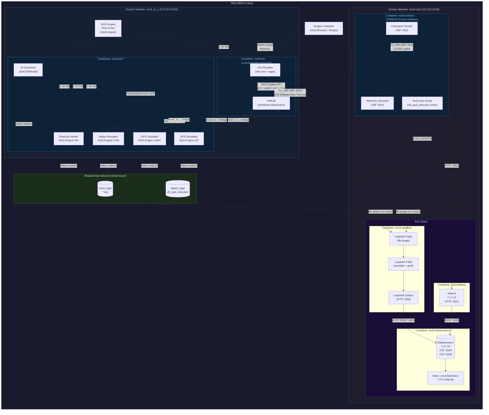
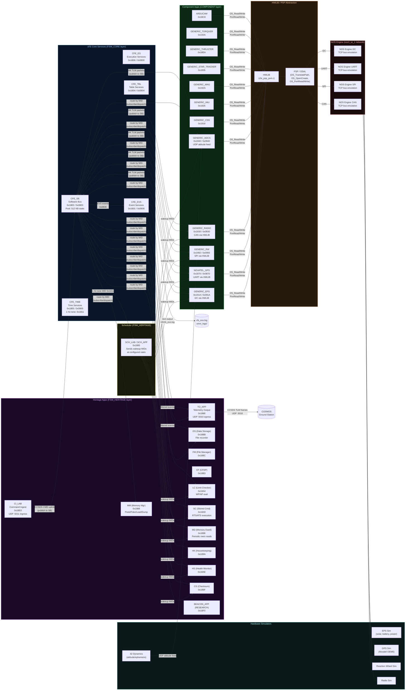
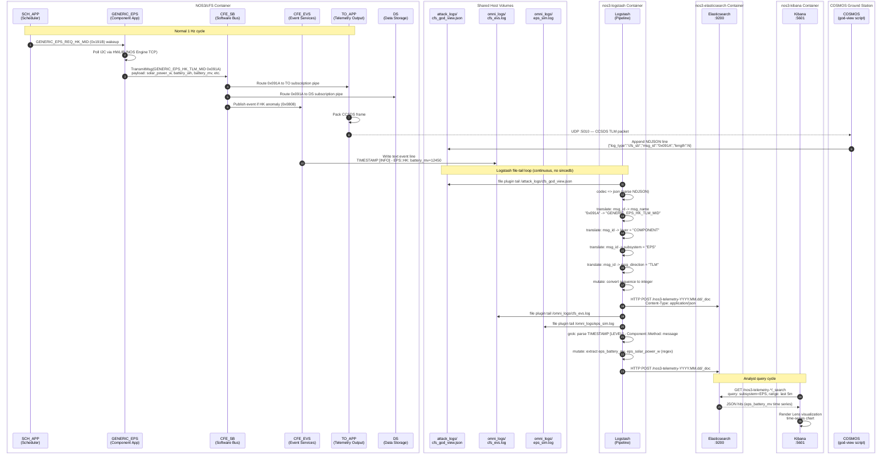
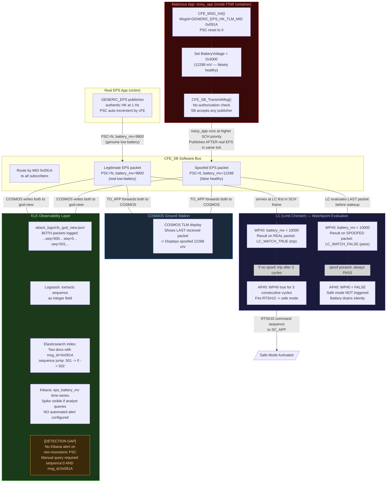
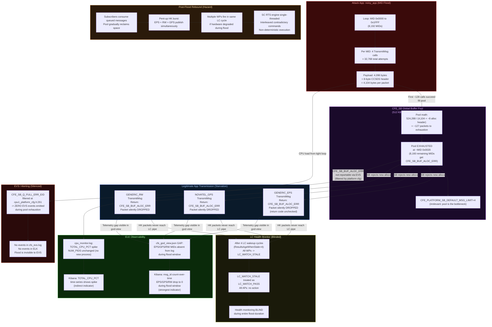
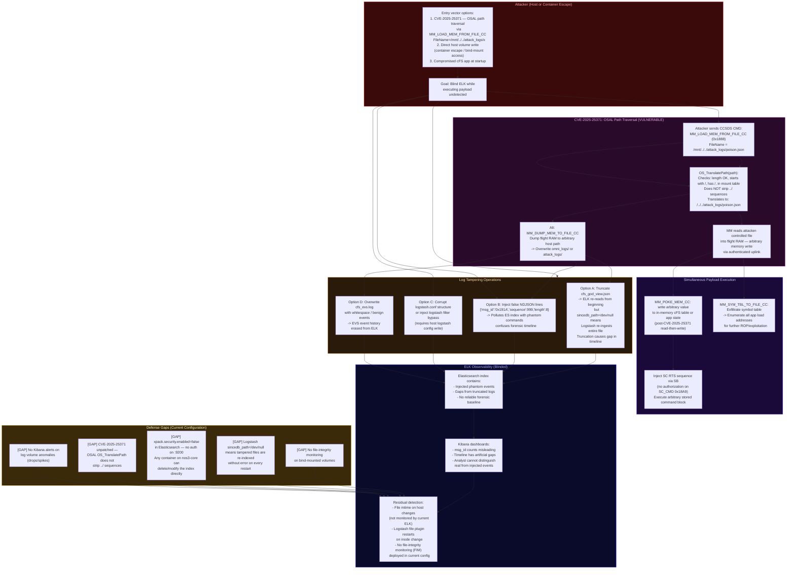

# NOS3/cFS Threat-Test Architecture

**Document scope:** Technical reference for the DTU satellite supply-chain research environment.
Covers the full Docker topology, internal cFS subsystem layout, the ELK telemetry pipeline, and
three active attack scenarios with detailed data-flow diagrams.

---

## Table of Contents

1. [Environment Overview](#1-environment-overview)
2. [Diagram 1 — Macro Architecture: Docker Networks and Data Pipelines](#2-diagram-1--macro-architecture)
3. [Diagram 2 — cFS and NOS3 Internal System Flow](#3-diagram-2--cfs-and-nos3-internal-system-flow)
4. [Diagram 3 — Telemetry, Log, and Metric Pipeline](#4-diagram-3--telemetry-log-and-metric-pipeline)
5. [Diagram 4 — Attack Scenario 1: Telemetry Spoofing / Command Injection](#5-diagram-4--attack-scenario-1-telemetry-spoofing--command-injection)
6. [Diagram 5 — Attack Scenario 2: Software Bus Resource Exhaustion (DoS)](#6-diagram-5--attack-scenario-2-software-bus-resource-exhaustion-dos)
7. [Diagram 6 — Attack Scenario 3: Log Tampering and Observability Evasion](#7-diagram-6--attack-scenario-3-log-tampering-and-observability-evasion)
8. [CCSDS Message ID Quick Reference](#8-ccsds-message-id-quick-reference)
9. [Vulnerability Summary](#9-vulnerability-summary)

---

## 1. Environment Overview

The test environment is fully containerized and runs on a single Linux host (WSL2/Docker Desktop).
Four logical subsystems interact over two Docker bridge networks:

| Subsystem | Container Name | Image | Exposed Ports |
|---|---|---|---|
| Flight Software (cFS) | `nos3-fsw` | `ivvitc/nos3-64:20251107` | 5011/udp (CI), 5010/udp (TO) |
| NOS3 Hardware Sims | `nos3-sim-*` | same build image | NOS Engine IPC |
| Ground Software (COSMOS) | `nos3-cosmos` | Ruby/COSMOS | 7779/tcp (API), 2900/tcp (TLM) |
| Elasticsearch | `nos3-elasticsearch` | `elasticsearch:7.17.10` | 9200/tcp, 9300/tcp |
| Logstash | `nos3-logstash` | `logstash:7.17.10` | 5044/tcp (Beats), 9600/tcp (monitoring) |
| Kibana | `nos3-kibana` | `kibana:7.17.10` | 5601/tcp |

Two Docker bridge networks partition the traffic:

- **`nos3-core`** — shared services plane: NOS Engine time driver, ground software, all ELK containers.
- **`nos3_sc_1`** — spacecraft-local plane: FSW container to each per-component hardware simulator.

Logstash reaches log files via Docker bind-mounts, not over the network:
- `../attack_logs/` bind-mounted read-only to `/attack_logs/` inside `nos3-logstash`
- `../omni_logs/` bind-mounted read-only to `/omni_logs/` inside `nos3-logstash`

---

## 2. Diagram 1 — Macro Architecture

### Technical Explanation

**Network isolation.** The `nos3_sc_1` bridge carries all spacecraft-internal traffic. NOS Engine
delivers hardware bus transactions (I2C, UART, SPI, CAN) to FSW via TCP sockets, emulating real
embedded bus timings. The HWLIB layer inside cFS translates OS calls into NOS Engine protocol
messages so the same FSW binary runs against emulated or real hardware without recompilation.

**Telemetry uplink/downlink.** The Telemetry Output app (`TO_APP`) opens a UDP socket and
streams packetized CCSDS telemetry to the COSMOS ground station on port 5010. Commands flow in
reverse via `CI_LAB`, which listens on UDP port 5011 and pushes received CCSDS command packets
onto the Software Bus as if they originated from a legitimate commanding source. This inbound
path is the primary attack surface for command injection.

**God-View logging.** A COSMOS background script subscribes to every telemetry definition and
writes one NDJSON line per Software Bus message received at the ground station to
`attack_logs/cfs_god_view.json`. This gives the ELK pipeline a near-complete view of all
Software Bus traffic without requiring an agent inside the FSW container.

**ELK ingestion.** Logstash uses the `file` input plugin with `start_position => beginning` and
`sincedb_path => /dev/null`, which means the pipeline re-indexes the entire log set on every
container restart. This is intentional for research replays. Logstash reaches the log files via
read-only Docker bind-mounts, not over the network. Security implication: tampering with log
files on the host volume is sufficient to poison the ELK index.

---

## 3. Diagram 2 — cFS and NOS3 Internal System Flow

### Technical Explanation

**Software Bus routing model.** The cFS Software Bus (`CFE_SB`) implements a publish-subscribe
message router. Every message is identified by a 16-bit Message ID (MID) encoded in the CCSDS
Primary Header. Commands carry MIDs in the range `0x1xxx`; telemetry MIDs are in `0x0xxx`. An
app calls `CFE_SB_TransmitMsg()` to publish; subscriber apps call `CFE_SB_ReceiveBuffer()` on
named pipe handles. There is no sender-identity field, no ownership model, and no
authorization check on which app may publish a given MID. Any app can publish any MID.

**Scheduler-driven execution.** `SCH_LAB` sends wakeup message IDs at configured rates (1 Hz, 4 Hz,
etc.) derived from its schedule table loaded at startup via `CFE_TBL`. Component apps block on
`CFE_SB_ReceiveBuffer()` and run only when the scheduler delivers their wakeup MID. This fixed
cadence means that any MID injected between two scheduler ticks can be the last packet a
subscriber sees before it evaluates that MID's data.

**HWLIB and PSP abstraction.** Component FSW apps call `HWLIB_*` functions which delegate to the
Platform Support Package (`PSP`). In the NOS3 environment, the PSP routes I/O through NOS Engine
TCP sockets to hardware simulators. The same call path is used for both simulation and
hardware-in-the-loop testing. Critically, `cfe_psp_port_direct.c` casts all port addresses to
non-`volatile` pointers, meaning compiler optimizations (e.g., LICM) can hoist reads out of
loops, creating stale-cache hardware-blinding conditions under aggressive optimization.

**EVS event logging.** `CFE_EVS` accepts formatted event messages from all apps and can route
them to multiple output ports: the Software Bus (`CFE_EVS_LONG_EVENT_MSG_MID 0x0808`), a local
binary log file, and stdout. The `cfs_evs.log` file in `omni_logs/` is the primary source of
application-level narrative events in the ELK pipeline.

---

## 4. Diagram 3 — Telemetry, Log, and Metric Pipeline

### Technical Explanation

**Two distinct data planes.** The pipeline ingests from two structurally different sources that
together give a complete picture:

- `cfs_god_view.json` (type=`software_bus`): produced by the COSMOS god-view script, which
  subscribes to every known TLM definition via the COSMOS API and serializes each received packet
  as one NDJSON line. The key fields are `msg_id` (hex string), `sequence` (CCSDS Primary
  Sequence Count), `length` (bytes), and `timestamp`. The MID-to-name translation table in
  Logstash covers every MID used by this mission, mapping them into human-readable `msg_name`,
  `layer`, `subsystem`, and `msg_direction` fields.

- `omni_logs/*.log` (type=`system_log`): one file per NOS3 simulator component plus auxiliary
  files (`cpu_monitor.log`, `cfs_evs.log`). These are plain-text files with the format
  `TIMESTAMP [LEVEL] - Component::Method:  message`. Logstash parses these with grok patterns
  and uses regex `mutate` filters to extract numeric telemetry values (e.g., `eps_battery_mv`,
  `rw_momentum`, `gps_lat`) as typed Elasticsearch fields suitable for Kibana visualizations.

**Index time-series model.** Elasticsearch receives documents via HTTP POST to a date-rolled index
(`nos3-telemetry-YYYY.MM.dd`). No Beats agents are deployed; Logstash acts as both shipper and
transformer. The absence of an in-container Beats agent is architecturally significant: there is
no process inside the FSW container that could be killed to interrupt data flow. Instead, an
attacker must tamper with the shared host volume files or exhaust the Software Bus to prevent
packets from reaching the god-view script at the ground station.

**Sequence counter forensics.** The `sequence` field (CCSDS Primary Sequence Count, 14-bit
auto-incrementing per source app) is indexed as an integer. A spoofed packet injected by a
foreign app resets to PSC=0, producing a non-monotonic jump mid-stream. This jump is the primary
forensic artifact of an in-process spoof attack and is queryable in Elasticsearch, though no
automated Kibana alert currently fires on it.

---

## 5. Diagram 4 — Attack Scenario 1: Telemetry Spoofing / Command Injection

**Threat model:** An attacker has code execution inside the NOS3 FSW container (e.g., via a
compromised cFS app loaded as a shared library, or a research app like `noisy_app` deliberately
introduced for testing). The attacker publishes a forged EPS housekeeping telemetry packet with
a false battery voltage designed to suppress LC watchpoint #0 and mask a real low-battery
condition from the health monitoring system.

### Technical Explanation

**Root cause — no publisher authorization.** `CFE_SB_TransmitMsg()` in cFE Draco 7.0.0-rc4
validates only: message pointer non-NULL, message size meets minimum header size, and MsgId
within configured space (`CFE_MISSION_SB_MAX_PIPE_DEPTH`). There is no ownership registry
associating a MsgId with a specific app. Any app can call `CFE_MSG_Init()` with
`GENERIC_EPS_HK_TLM_MID` and `CFE_SB_TransmitMsg()` immediately after. The bus accepts and
routes the packet identically to a legitimate EPS HK packet.

**Temporal exploitation.** The `noisy_app` research app is assigned scheduler priority 20 —
higher than the EPS component app. Within a single 1 Hz SCH frame, the EPS app publishes its
authentic HK packet first, then `noisy_app` publishes the spoofed packet. LC evaluates the
last packet received on its subscription pipe before the LC wakeup MID fires. By placing the
spoof after the authentic packet in the same tick, the spoofed value wins every evaluation.

**LC watchpoint suppression mechanics.** LC watchpoint #0 compares
`GENERIC_EPS_HK_TLM_MID.Payload.BatteryVoltage` against threshold 10000 mV. With
`BatteryVoltage=0x3000` (12288), the result is `LC_WATCH_FALSE` (no trip). After the configured
`ResultsAgeWhenStale` (4 cycles), a stale result is treated as `LC_WATCH_PASS`, so even a flood
that drops all EPS packets also suppresses the alert.

**CCSDS sequence counter artifact.** `CFE_MSG_Init()` resets the CCSDS Primary Sequence Count
to 0. The real EPS app's sequence counter auto-increments continuously. The god-view log will
contain: `...sequence=500, sequence=501, sequence=0, sequence=502...` — the reset to 0
mid-stream is the canonical forensic signature of this attack and is queryable in Elasticsearch
but is not alerted by any configured Kibana rule.

---

## 6. Diagram 5 — Attack Scenario 2: Software Bus Resource Exhaustion (DoS)

**Threat model:** A malicious or compromised cFS app floods the Software Bus with oversized
packets across all valid MIDs, exhausting the single static 512 KB shared buffer pool.
All legitimate sensor HK packets fail to allocate; the LC health monitor goes blind.

### Technical Explanation

**Pool architecture.** cFE SB uses a single static memory arena of
`CFE_PLATFORM_SB_BUF_MEMORY_BYTES = 524,288` bytes (512 KB) allocated at startup. All in-flight
messages from all apps, across all pipes and all MID subscriptions, draw from this single pool.
There is no per-app or per-MID quota enforcement at the pool level.

**Flood packet sizing.** The `noisy_app` attack allocates packets of `sizeof(NOISY_APP_Pkt_t)` =
4,096-byte payload + 8-byte CCSDS header = 4,104 bytes per packet. Including an approximately
8-byte internal allocation header, each allocation claims ~4,112 bytes. Pool exhaustion
occurs after approximately 127 packets, which is reached before the MID loop increments past
`0x0020` — leaving 8,160 MIDs worth of `TransmitMsg()` calls returning
`CFE_SB_BUF_ALOC_ERR` silently.

**Per-pipe limit bypass.** `CFE_PLATFORM_SB_DEFAULT_MSG_LIMIT = 4` limits how many messages of a
single MID can queue on a single pipe. This limit is never the binding constraint here because
the global pool is exhausted first. The per-pipe limit is effectively bypassed as a side-effect
of the pool flood geometry.

**EVS silence.** The critical evasion property of this attack is that
`CFE_SB_Q_FULL_ERR_EID` is filtered at `cpu1_platform_cfg.h` line 261. No EVS events are
emitted during pool exhaustion. The `cfs_evs.log` file and therefore the ELK event timeline
show no anomaly during the flood. The only observable artifacts are: (1) a CPU usage spike in
`cpu_monitor.log` from the tight transmission loop, and (2) a gap in `cfs_god_view.json` where
EPS/GPS/RW MIDs stop appearing, because TO_APP itself cannot allocate buffer to forward their
packets to the ground station.

**Post-flood rebound hazard.** When the flood app exits and queued messages are consumed,
the pool recovers. Pent-up sensor HK publications arrive simultaneously. If real hardware
degradation occurred during the blind period (e.g., actual low battery), multiple LC
watchpoints trip in the same cycle, firing multiple Actionpoints. The SC stored-command RTS
engine is single-threaded; interleaved contradictory RTS commands (e.g., safe-mode entry
and a science mode resume) produce non-deterministic execution order.

---

## 7. Diagram 6 — Attack Scenario 3: Log Tampering and Observability Evasion

**Threat model:** An attacker with host-level write access to the Docker bind-mount volumes
(i.e., having escaped the FSW container or compromised the build host) tampers with log files to
poison or blind the ELK index while executing a payload. The attack leverages
CVE-2025-25371 (OSAL path traversal, confirmed VULNERABLE) to read or write arbitrary host files
via authenticated CCSDS commands to the MM (Memory Manager) app.

### Technical Explanation

**CVE-2025-25371 — OSAL path traversal.** `OS_TranslatePath()` in
`osal/src/os/posix/os-impl-filesys.c` performs four checks: path length within `OS_MAX_PATH_LEN`
(64), path starts with `/`, path contains `/`, and path prefix is in the virtual-to-physical
mount table. It does NOT canonicalize the path or strip `../` sequences. An attacker with
authenticated CCSDS uplink access (i.e., access to the CI_LAB UDP port 5011 or the COSMOS
command interface) can craft `FileName = /mnt/../../attack_logs/evil.json` which passes all four
checks and resolves to an arbitrary host path reachable from the FSW container.

Three MM command codes exploit this surface:
- `MM_LOAD_MEM_FROM_FILE_CC` (`0x1888`+CC=2): reads attacker-controlled file content into
  arbitrary flight RAM — equivalent to an arbitrary memory write primitive.
- `MM_DUMP_MEM_TO_FILE_CC` (`0x1888`+CC=3): writes a range of flight RAM to an attacker-
  specified file path — arbitrary host file write.
- `MM_SYM_TBL_TO_FILE_CC` (`0x1888`+CC=5): dumps the cFS symbol table (all app load addresses,
  global variables) to a file — information disclosure enabling further exploitation.

**Log poisoning mechanics.** The Logstash pipeline uses `sincedb_path => /dev/null`, which
disables position tracking. On every container restart, Logstash re-reads both log files from
byte 0. This is intentional for research replay but creates a vulnerability: an attacker who
truncates `cfs_god_view.json` and replaces it with a crafted version will have their fabricated
events fully indexed on the next Logstash restart. Injected NDJSON lines with plausible MIDs
and sequences are indistinguishable from authentic records in Kibana.

**Elasticsearch authentication gap.** The ELK stack is deployed with `xpack.security.enabled=false`
(docker-compose.yml line 8). Any container on the `nos3-core` Docker network can issue
unauthenticated HTTP DELETE or POST requests to Elasticsearch port 9200. A compromised COSMOS
container could delete the entire `nos3-telemetry-*` index family, permanently destroying the
forensic record, without touching any host filesystem.

**No file-integrity monitoring.** There is no Auditd, AIDE, or Filebeat with FIM module
monitoring the bind-mount volumes. Changes to `attack_logs/` or `omni_logs/` on the host are
not detected by any component of the current observability stack.

---

## 8. CCSDS Message ID Quick Reference

Commands use MID range `0x1xxx`; telemetry uses `0x0xxx`.

### cFE Core Services

| App | CMD MID | TLM HK MID | Notes |
|---|---|---|---|
| CFE_ES | 0x1806 | 0x0800 | App lifecycle, memory stats |
| CFE_EVS | 0x1801 | 0x0801 | Event services; long event: 0x0808 |
| CFE_SB | 0x1803 | 0x0803 | Pipe stats: 0x080A |
| CFE_TBL | 0x1804 | 0x0804 | Table registry: 0x080C |
| CFE_TIME | 0x1805 | 0x0805 | 1 Hz tone: 0x1811 |

### Heritage Apps

| App | CMD MID | HK TLM | Notes |
|---|---|---|---|
| SCH_APP | 0x1895 | 0x0897 | Schedule table driver |
| TO_APP | 0x1880 | 0x0880 | UDP egress :5010 |
| CI_LAB | 0x18E0 | 0x08E0 | UDP ingress :5011 |
| DS | 0x18BB | 0x08B8 | File data storage |
| FM | 0x188C | 0x088A | File manager |
| MM | 0x1888 | 0x0887 | Memory manager (CVE-2025-25371 surface) |
| LC | 0x18A4 | 0x08A7 | Limit checker / watchpoints |
| SC | 0x18A9 | 0x08AA | Stored commands / RTS |
| MD | 0x1890 | 0x0890 | Memory dwell |
| HS | 0x18AE | 0x08AD | Health monitor |

### Component Apps

| App | CMD MID | HK TLM | Bus |
|---|---|---|---|
| GENERIC_EPS | 0x191A | 0x091A | I2C |
| NOVATEL_GPS | 0x1870 | 0x0870 | UART |
| GENERIC_RW | 0x1992 | 0x0993 | SPI |
| GENERIC_RADIO | 0x1930 | 0x0930 | CAN |
| GENERIC_ADCS | 0x1940 | 0x0940 | UDP (42 dynamics) |
| GENERIC_CSS | 0x1910 | 0x0910 | — |
| GENERIC_IMU | 0x1925 | 0x0925 | — |
| GENERIC_MAG | 0x192A | 0x092A | — |
| GENERIC_STAR_TRACKER | 0x1935 | 0x0935 | — |
| GENERIC_THRUSTER | 0x18EA | 0x08EA | — |
| GENERIC_TORQUER | 0x193A | 0x093A | — |
| ARDUCAM | 0x18C8 | 0x08C8 | — |
| BEACON_APP | 0x18F0 | 0x08F0 | RESEARCH layer |
| SAMPLE_APP | 0x18FA | 0x08FA | COMPONENT layer |

---

## 9. Vulnerability Summary

| ID | Category | Severity | Status | Attack Scenario |
|---|---|---|---|---|
| CVE-2025-25371 | OSAL path traversal | High | VULNERABLE | Scenario 3 (log tamper, exfil) |
| CVE-2025-25372 | MM DoS/segfault | Medium | PATCHED | — |
| CVE-2025-25373 | MM RCE | Critical | PATCHED | — |
| H-SB-AUTH | No SB publisher auth | High | Architectural (no fix) | Scenario 1 (telemetry spoof) |
| H-SB-POOL | SB pool exhaustion | High | Architectural (no fix) | Scenario 2 (DoS) |
| H-ES-NOAUTH | ES unauthenticated | High | Config gap | Scenario 3 (index wipe) |
| H-ELK-FIM | No file-integrity monitoring | Medium | Config gap | Scenario 3 |
| H-EVS-FILTER | EVS alloc errors filtered | Medium | Config gap | Scenario 2 |
| H-SEQ-NOALERT | No monotonic PSC alert | Low | Detection gap | Scenario 1 |
| H-PSC-LICM | PSP non-volatile port access | Medium | Code defect | Scenario 4 (ADCS blinding) |

### Detection Coverage Matrix

| Attack | CPU Spike (Kibana) | MID Gap (Kibana) | PSC Jump (ES query) | EVS Event | FIM Alert |
|---|---|---|---|---|---|
| Scenario 1 — Spoof | No | No | Yes (manual) | No | No |
| Scenario 2 — DoS | Yes | Yes | No | No | No |
| Scenario 3 — Log Tamper | No | Partial | No | No | No |

All three scenarios demonstrate that the current ELK pipeline provides reactive, analyst-driven
detection only. No automated alerting rules are configured for any of the attack-specific
indicators identified in this document.
